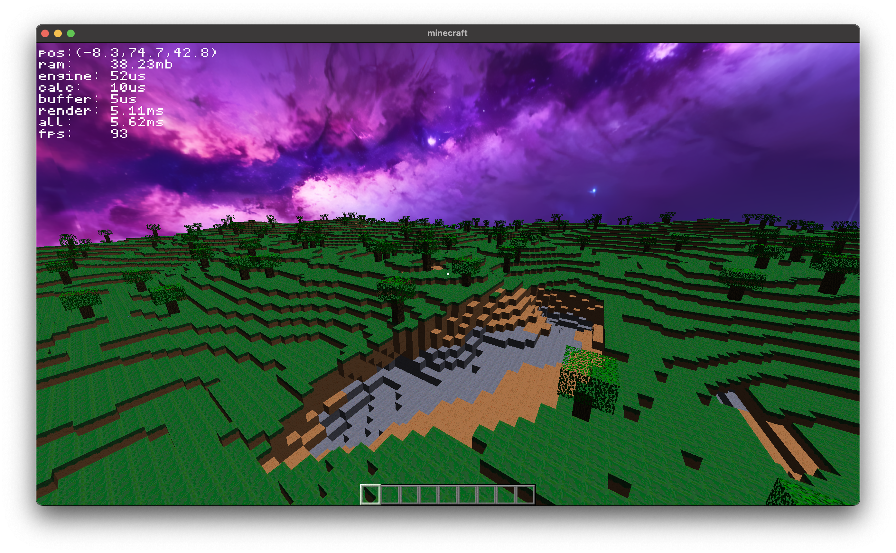
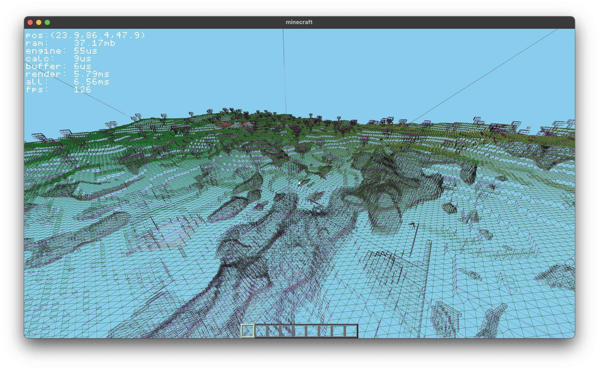

# minecraft
finally taking a stab at the mc clone      
[cs 384g final project](https://www.cs.utexas.edu/~graphics/s25/cs354h/final/overview/)           
Frank Collebrusco             
Arsh Guntakal              




# instructions 
## download
this project has a lot of nested submodules so be sure to init those properly.  
clone with `--recurse-submodules` like so:    
```bash
git clone --recurse-submodules git@github.com:collebrusco/minecraft
```
if you already cloned it without recursing submodules you can always just run
```bash
git submodule update --init --recursive
```
that'll check them out.
   
## build
### dependencies
- CMake
- C++ compiler
- OpenGL support
- On linux, you'll need the GL dev packages (libgl-dev, xorg-dev, libx11-dev, libxrandr-dev, libxinerama-dev, libxcursor-dev, libxi-dev, libxext-dev) i think thats it. 

### building
Building is just your standard CMake usage. On mac and linux, it's as simple as:
```bash
	mkdir -p build && \
	cd build && \
	cmake .. && \
	make -j
```
running `make` in the top level repo will do the above by default.    
On Windows, you need to tell CMake what build system to generate for. I like to use MinGW and Make for Windows to build a native exe unix-style. To do that, replace `cmake ..` with `cmake -G "MinGW Makefiles" ..`. CMake can also generate visual studio projects and other stuff.

## run
**the executable MUST be run from the top level repo dir**    
so run it like `./build/minecraft` from the top level repo dir.    

## controls
- WASD -- move
- left/right click -- break / place
- Space -- jump
- E -- open inventory
- C -- toggle flight
- period & comma -- both multiply speed by 5
- K -- toggle wireframe


